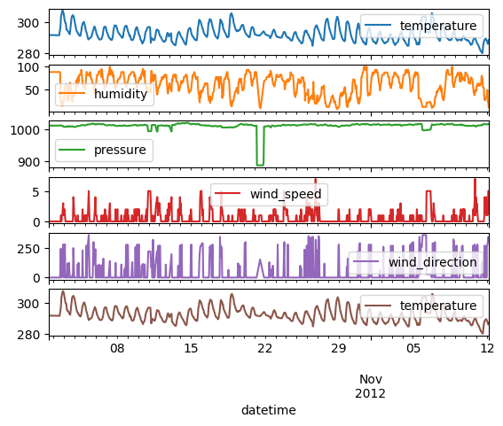
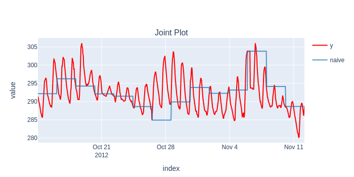
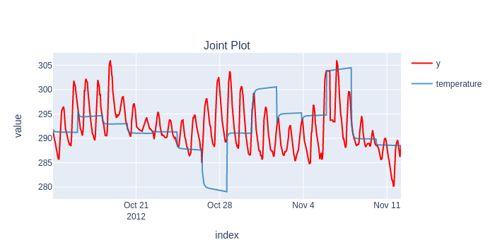
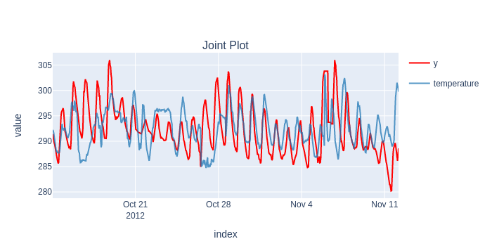
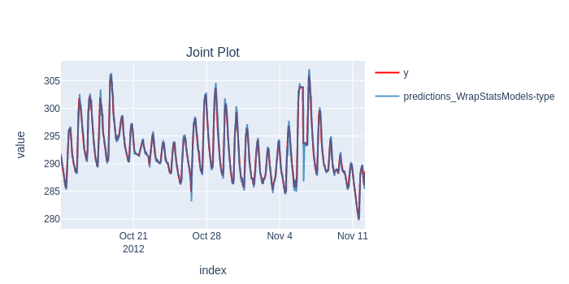
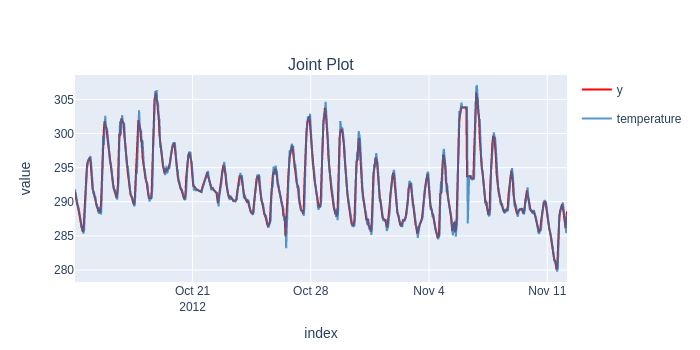
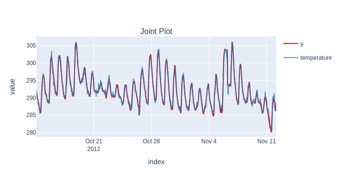

# Benchmarking the speed of [fold](https://github.com/dream-faster/fold) and SKTime.

[:material-download:  Download](benchmarking_sktime_fold.ipynb){ .md-button }   [:simple-googlecolab:  Open In Colab](https://colab.research.google.com/drive/1iLXpty-j1kpDCzLM4fCsP3fLoS_DFN1C?usp=sharing){ .md-button .md-button--primary }


## Installing libraries, defining utility functions


```python
%%capture
pip install --quiet https://github.com/dream-faster/fold/archive/main.zip https://github.com/dream-faster/fold-models/archive/main.zip https://github.com/dream-faster/krisi/archive/main.zip https://github.com/dream-faster/fold-wrappers/archive/main.zip matplotlib seaborn xgboost plotly prophet statsforecast statsmodels ray kaleido sktime pmdarima
```


```python
from time import monotonic
import pandas as pd
from collections import defaultdict
from krisi import score
from krisi.report import plot_y_predictions
import plotly.io as pio
pio.renderers.default = "png"

class Timing:
    results = defaultdict(lambda: defaultdict(dict))
        
    def record_time(self, model_name: str, framework: str):
        def wrapper( function, *args, **kwargs):
            start_time = monotonic()
            return_value = function(*args, **kwargs)
            print(f"Run time: {monotonic() - start_time} seconds")

            self.results[framework][model_name] = monotonic() - start_time
            return return_value
        return wrapper
    def summary(self):
        pd.set_option('display.max_rows', None)
        pd.set_option('display.max_columns', None)
        pd.set_option('display.colheader_justify', 'center')
        pd.set_option('display.precision', 3)
        display(pd.DataFrame(self.results))

timing = Timing()

def flatten_result_windows(series: pd.Series) -> pd.Series:
    return pd.concat(series.to_list())
```

## Data Loading


```python
from fold.utils.dataset import get_preprocessed_dataset

X, y = get_preprocessed_dataset(
    "weather/historical_hourly_la", target_col="temperature", resample="H", shorten=1000
)

print(X.head());
print(y.head());
pd.concat([y,X], axis='columns').plot(subplots=True);
```

                         humidity  pressure  wind_speed  wind_direction  \
    datetime                                                              
    2012-10-01 13:00:00      88.0    1013.0         0.0             0.0   
    2012-10-01 14:00:00      88.0    1013.0         0.0             0.0   
    2012-10-01 15:00:00      88.0    1013.0         0.0             0.0   
    2012-10-01 16:00:00      88.0    1013.0         0.0             0.0   
    2012-10-01 17:00:00      88.0    1013.0         0.0             0.0   
    
                         temperature  
    datetime                          
    2012-10-01 13:00:00   291.870000  
    2012-10-01 14:00:00   291.868186  
    2012-10-01 15:00:00   291.862844  
    2012-10-01 16:00:00   291.857503  
    2012-10-01 17:00:00   291.852162  
    datetime
    2012-10-01 13:00:00    291.868186
    2012-10-01 14:00:00    291.862844
    2012-10-01 15:00:00    291.857503
    2012-10-01 16:00:00    291.852162
    2012-10-01 17:00:00    291.846821
    Freq: H, Name: temperature, dtype: float64


    

    


```python
# Default values that both sktime and fold will receive

step_size = 50
initial_train_size = 300
lag_length_for_tabular_models = 10
fh=list(range(1, step_size+1))
```

## SKTime - Long forecasting horizon (Time Series Cross-Validation)


```python
from sktime.forecasting.model_evaluation import evaluate
from sktime.forecasting.model_selection import ExpandingWindowSplitter as SKTimeExpandingWindowSplitter
from sktime.forecasting.naive import NaiveForecaster
from sktime.forecasting.arima import ARIMA
from sktime.pipeline import make_pipeline
from sktime.forecasting.compose import make_reduction
```


```python
cv = SKTimeExpandingWindowSplitter(initial_window=initial_train_size, step_length=step_size, fh=fh)
```

### Naive


```python
forecaster = NaiveForecaster(strategy="last")
results = timing.record_time('naive', 'sktime (long-fh)')(evaluate, forecaster=forecaster, y=y, X=X, cv=cv, return_data=True, error_score='raise')
predictions = flatten_result_windows(results['y_pred']).rename("naive")
plot_y_predictions(y[predictions.index], predictions.to_frame(), mode="overlap")
score(y[predictions.index], predictions)[['rmse']].print('minimal')
```

    Run time: 0.32869669699999804 seconds


    

    


<pre style="white-space:pre;overflow-x:auto;line-height:normal;font-family:Menlo,'DejaVu Sans Mono',consolas,'Courier New',monospace">                                            naive
                 Root Mean Squared Error  <span style="color: #008080; text-decoration-color: #008080; font-weight: bold">5.36894</span>
</pre>


### Statsmodels ARIMA


```python
forecaster = ARIMA((1,1,0))

results = timing.record_time('arima', 'sktime (long-fh)')(evaluate, forecaster=forecaster, y=y, cv=cv, return_data=True, error_score='raise')
predictions = flatten_result_windows(results['y_pred'])
plot_y_predictions(y[predictions.index], predictions.to_frame(), mode="overlap")
score(y[predictions.index], predictions)[['rmse']].print('minimal')
```

    Run time: 2.449221571999999 seconds


    

    


<pre style="white-space:pre;overflow-x:auto;line-height:normal;font-family:Menlo,'DejaVu Sans Mono',consolas,'Courier New',monospace">                                          temperature
                 Root Mean Squared Error     <span style="color: #008080; text-decoration-color: #008080; font-weight: bold">6.743475</span>
</pre>


A seasonal ARIMA - not suprisingly - provides much better results, but because of the slowness (and out of memory errors), we couldn't benchmark Statsmodels' implementation.

### XGBoost


```python
from xgboost import XGBRegressor
regressor = XGBRegressor(random_state=42)

forecaster = make_reduction(regressor, strategy="recursive", window_length=lag_length_for_tabular_models)
results = timing.record_time('xgboost', 'sktime (long-fh)')(evaluate, forecaster=forecaster, y=y, X=X, cv=cv, backend="multiprocessing", return_data=True, error_score='raise')
predictions = flatten_result_windows(results['y_pred'])
plot_y_predictions(y[predictions.index], predictions.to_frame(), mode="overlap")
score(y[predictions.index], predictions)[['rmse']].print('minimal')
```

    Run time: 44.59098899100002 seconds


    

    


<pre style="white-space:pre;overflow-x:auto;line-height:normal;font-family:Menlo,'DejaVu Sans Mono',consolas,'Courier New',monospace">                                          temperature
                 Root Mean Squared Error     <span style="color: #008080; text-decoration-color: #008080; font-weight: bold">5.044424</span>
</pre>


### Results


```python
timing.summary()
```


  <div id="df-9190ebbe-b233-46d8-8e6b-b72c9039b13d">
    <div class="colab-df-container">
      <div>
<style scoped>
    .dataframe tbody tr th:only-of-type {
        vertical-align: middle;
    }

    .dataframe tbody tr th {
        vertical-align: top;
    }

    .dataframe thead th {
        text-align: right;
    }
</style>
<table border="1" class="dataframe">
  <thead>
    <tr style="text-align: center;">
      <th></th>
      <th>sktime (long-fh)</th>
    </tr>
  </thead>
  <tbody>
    <tr>
      <th>arima</th>
      <td>2.449</td>
    </tr>
    <tr>
      <th>naive</th>
      <td>0.329</td>
    </tr>
    <tr>
      <th>xgboost</th>
      <td>44.591</td>
    </tr>
  </tbody>
</table>
</div>
      <button class="colab-df-convert" onclick="convertToInteractive('df-9190ebbe-b233-46d8-8e6b-b72c9039b13d')"
              title="Convert this dataframe to an interactive table."
              style="display:none;">

  <svg xmlns="http://www.w3.org/2000/svg" height="24px"viewBox="0 0 24 24"
       width="24px">
    <path d="M0 0h24v24H0V0z" fill="none"/>
    <path d="M18.56 5.44l.94 2.06.94-2.06 2.06-.94-2.06-.94-.94-2.06-.94 2.06-2.06.94zm-11 1L8.5 8.5l.94-2.06 2.06-.94-2.06-.94L8.5 2.5l-.94 2.06-2.06.94zm10 10l.94 2.06.94-2.06 2.06-.94-2.06-.94-.94-2.06-.94 2.06-2.06.94z"/><path d="M17.41 7.96l-1.37-1.37c-.4-.4-.92-.59-1.43-.59-.52 0-1.04.2-1.43.59L10.3 9.45l-7.72 7.72c-.78.78-.78 2.05 0 2.83L4 21.41c.39.39.9.59 1.41.59.51 0 1.02-.2 1.41-.59l7.78-7.78 2.81-2.81c.8-.78.8-2.07 0-2.86zM5.41 20L4 18.59l7.72-7.72 1.47 1.35L5.41 20z"/>
  </svg>
      </button>

  <style>
    .colab-df-container {
      display:flex;
      flex-wrap:wrap;
      gap: 12px;
    }

    .colab-df-convert {
      background-color: #E8F0FE;
      border: none;
      border-radius: 50%;
      cursor: pointer;
      display: none;
      fill: #1967D2;
      height: 32px;
      padding: 0 0 0 0;
      width: 32px;
    }

    .colab-df-convert:hover {
      background-color: #E2EBFA;
      box-shadow: 0px 1px 2px rgba(60, 64, 67, 0.3), 0px 1px 3px 1px rgba(60, 64, 67, 0.15);
      fill: #174EA6;
    }

    [theme=dark] .colab-df-convert {
      background-color: #3B4455;
      fill: #D2E3FC;
    }

    [theme=dark] .colab-df-convert:hover {
      background-color: #434B5C;
      box-shadow: 0px 1px 3px 1px rgba(0, 0, 0, 0.15);
      filter: drop-shadow(0px 1px 2px rgba(0, 0, 0, 0.3));
      fill: #FFFFFF;
    }
  </style>

      <script>
        const buttonEl =
          document.querySelector('#df-9190ebbe-b233-46d8-8e6b-b72c9039b13d button.colab-df-convert');
        buttonEl.style.display =
          google.colab.kernel.accessAllowed ? 'block' : 'none';

        async function convertToInteractive(key) {
          const element = document.querySelector('#df-9190ebbe-b233-46d8-8e6b-b72c9039b13d');
          const dataTable =
            await google.colab.kernel.invokeFunction('convertToInteractive',
                                                     [key], {});
          if (!dataTable) return;

          const docLinkHtml = 'Like what you see? Visit the ' +
            '<a target="_blank" href=https://colab.research.google.com/notebooks/data_table.ipynb>data table notebook</a>'
            + ' to learn more about interactive tables.';
          element.innerHTML = '';
          dataTable['output_type'] = 'display_data';
          await google.colab.output.renderOutput(dataTable, element);
          const docLink = document.createElement('div');
          docLink.innerHTML = docLinkHtml;
          element.appendChild(docLink);
        }
      </script>
    </div>
  </div>


SKTime may look fast on its own, but it definitely falls short when it comes to the real usefulness of Time Series Cross-Validation.

The models are static, stuck in the past between end of the training windows, they don't have access to the latest value, and therefore their predictions are way off.

## Fold - Short forecasting horizon (Continuous Validation)

[fold](https://github.com/dream-faster/fold) has the ability to update models within the test window, in an "online" manner:


```python
from fold import train_evaluate, ExpandingWindowSplitter, Backend
from fold.transformations import AddLagsX
from fold_wrappers import WrapXGB, WrapStatsModels
from fold_models import Naive
from statsmodels.tsa.arima.model import ARIMA as StatsModelARIMA
from fold_models.baseline import Naive
import ray
ray.init(ignore_reinit_error=True)
```

    2023-04-17 11:07:04,950	INFO worker.py:1553 -- Started a local Ray instance.


<div>
    <div style="margin-left: 50px;display: flex;flex-direction: row;align-items: center">
        <h3 style="color: var(--jp-ui-font-color0)">Ray</h3>
        <svg version="1.1" id="ray" width="3em" viewBox="0 0 144.5 144.6" style="margin-left: 3em;margin-right: 3em">
            <g id="layer-1">
                <path fill="#00a2e9" class="st0" d="M97.3,77.2c-3.8-1.1-6.2,0.9-8.3,5.1c-3.5,6.8-9.9,9.9-17.4,9.6S58,88.1,54.8,81.2c-1.4-3-3-4-6.3-4.1
                    c-5.6-0.1-9.9,0.1-13.1,6.4c-3.8,7.6-13.6,10.2-21.8,7.6C5.2,88.4-0.4,80.5,0,71.7c0.1-8.4,5.7-15.8,13.8-18.2
                    c8.4-2.6,17.5,0.7,22.3,8c1.3,1.9,1.3,5.2,3.6,5.6c3.9,0.6,8,0.2,12,0.2c1.8,0,1.9-1.6,2.4-2.8c3.5-7.8,9.7-11.8,18-11.9
                    c8.2-0.1,14.4,3.9,17.8,11.4c1.3,2.8,2.9,3.6,5.7,3.3c1-0.1,2,0.1,3,0c2.8-0.5,6.4,1.7,8.1-2.7s-2.3-5.5-4.1-7.5
                    c-5.1-5.7-10.9-10.8-16.1-16.3C84,38,81.9,37.1,78,38.3C66.7,42,56.2,35.7,53,24.1C50.3,14,57.3,2.8,67.7,0.5
                    C78.4-2,89,4.7,91.5,15.3c0.1,0.3,0.1,0.5,0.2,0.8c0.7,3.4,0.7,6.9-0.8,9.8c-1.7,3.2-0.8,5,1.5,7.2c6.7,6.5,13.3,13,19.8,19.7
                    c1.8,1.8,3,2.1,5.5,1.2c9.1-3.4,17.9-0.6,23.4,7c4.8,6.9,4.6,16.1-0.4,22.9c-5.4,7.2-14.2,9.9-23.1,6.5c-2.3-0.9-3.5-0.6-5.1,1.1
                    c-6.7,6.9-13.6,13.7-20.5,20.4c-1.8,1.8-2.5,3.2-1.4,5.9c3.5,8.7,0.3,18.6-7.7,23.6c-7.9,5-18.2,3.8-24.8-2.9
                    c-6.4-6.4-7.4-16.2-2.5-24.3c4.9-7.8,14.5-11,23.1-7.8c3,1.1,4.7,0.5,6.9-1.7C91.7,98.4,98,92.3,104.2,86c1.6-1.6,4.1-2.7,2.6-6.2
                    c-1.4-3.3-3.8-2.5-6.2-2.6C99.8,77.2,98.9,77.2,97.3,77.2z M72.1,29.7c5.5,0.1,9.9-4.3,10-9.8c0-0.1,0-0.2,0-0.3
                    C81.8,14,77,9.8,71.5,10.2c-5,0.3-9,4.2-9.3,9.2c-0.2,5.5,4,10.1,9.5,10.3C71.8,29.7,72,29.7,72.1,29.7z M72.3,62.3
                    c-5.4-0.1-9.9,4.2-10.1,9.7c0,0.2,0,0.3,0,0.5c0.2,5.4,4.5,9.7,9.9,10c5.1,0.1,9.9-4.7,10.1-9.8c0.2-5.5-4-10-9.5-10.3
                    C72.6,62.3,72.4,62.3,72.3,62.3z M115,72.5c0.1,5.4,4.5,9.7,9.8,9.9c5.6-0.2,10-4.8,10-10.4c-0.2-5.4-4.6-9.7-10-9.7
                    c-5.3-0.1-9.8,4.2-9.9,9.5C115,72.1,115,72.3,115,72.5z M19.5,62.3c-5.4,0.1-9.8,4.4-10,9.8c-0.1,5.1,5.2,10.4,10.2,10.3
                    c5.6-0.2,10-4.9,9.8-10.5c-0.1-5.4-4.5-9.7-9.9-9.6C19.6,62.3,19.5,62.3,19.5,62.3z M71.8,134.6c5.9,0.2,10.3-3.9,10.4-9.6
                    c0.5-5.5-3.6-10.4-9.1-10.8c-5.5-0.5-10.4,3.6-10.8,9.1c0,0.5,0,0.9,0,1.4c-0.2,5.3,4,9.8,9.3,10
                    C71.6,134.6,71.7,134.6,71.8,134.6z"/>
            </g>
        </svg>
        <table>
            <tr>
                <td style="text-align: left"><b>Python version:</b></td>
                <td style="text-align: left"><b>3.9.16</b></td>
            </tr>
            <tr>
                <td style="text-align: left"><b>Ray version:</b></td>
                <td style="text-align: left"><b> 2.3.1</b></td>
            </tr>

        </table>
    </div>
</div>


```python
splitter = ExpandingWindowSplitter(initial_train_window=initial_train_size, step=step_size) 
```

### Naive


```python
model = Naive()

scorecard, predictions, _ = timing.record_time('naive', 'fold (online)')(train_evaluate, model, None, y, splitter, backend=Backend.no, silent=True)
plot_y_predictions(y[predictions.index], predictions, mode="overlap")
scorecard[['rmse']].print('minimal')
```

    Run time: 0.17832120899998927 seconds


    

    


<pre style="white-space:pre;overflow-x:auto;line-height:normal;font-family:Menlo,'DejaVu Sans Mono',consolas,'Courier New',monospace">                                          predictions_Naive
                 Root Mean Squared Error        <span style="color: #008080; text-decoration-color: #008080; font-weight: bold">1.224</span>      
</pre>


### Statsmodels ARIMA (Online)


```python
model = WrapStatsModels(StatsModelARIMA, init_args=dict(order=(1, 1, 0)), online_mode=True)
scorecard, predictions, _ = timing.record_time('arima', 'fold (online)')(train_evaluate, model, None, y, splitter, backend=Backend.no, silent=True)
plot_y_predictions(y[predictions.index], predictions, mode="overlap")
scorecard[['rmse']].print('minimal')
```

    Run time: 41.32513004100002 seconds


    

    


<pre style="white-space:pre;overflow-x:auto;line-height:normal;font-family:Menlo,'DejaVu Sans Mono',consolas,'Courier New',monospace">                                          predictions_WrapStatsModels-type
                 Root Mean Squared Error                <span style="color: #008080; text-decoration-color: #008080; font-weight: bold">0.927</span>             
</pre>


### XGBoost


```python
from xgboost import XGBRegressor
model = XGBRegressor(random_state=42)
pipeline = [AddLagsX(("all", list(range(lag_length_for_tabular_models))) ), model]

scorecard, predictions, _ = timing.record_time('xgboost', 'fold (online)')(train_evaluate, pipeline, X, y, splitter, backend=Backend.ray, silent=True)
plot_y_predictions(y[predictions.index], predictions, mode="overlap")
scorecard[['rmse']].print('minimal')
```

This results in much more realistic simulation of past performance (in case the last value is available in production).

### Results


```python
timing.summary()
```


  <div id="df-4f115e4a-e515-4317-af47-c984a43718d1">
    <div class="colab-df-container">
      <div>
<style scoped>
    .dataframe tbody tr th:only-of-type {
        vertical-align: middle;
    }

    .dataframe tbody tr th {
        vertical-align: top;
    }

    .dataframe thead th {
        text-align: right;
    }
</style>
<table border="1" class="dataframe">
  <thead>
    <tr style="text-align: center;">
      <th></th>
      <th>sktime (long-fh)</th>
      <th>fold (online)</th>
    </tr>
  </thead>
  <tbody>
    <tr>
      <th>naive</th>
      <td>0.329</td>
      <td>0.180</td>
    </tr>
    <tr>
      <th>arima</th>
      <td>2.449</td>
      <td>41.325</td>
    </tr>
    <tr>
      <th>xgboost</th>
      <td>44.591</td>
      <td>13.256</td>
    </tr>
  </tbody>
</table>
</div>
      <button class="colab-df-convert" onclick="convertToInteractive('df-4f115e4a-e515-4317-af47-c984a43718d1')"
              title="Convert this dataframe to an interactive table."
              style="display:none;">

  <svg xmlns="http://www.w3.org/2000/svg" height="24px"viewBox="0 0 24 24"
       width="24px">
    <path d="M0 0h24v24H0V0z" fill="none"/>
    <path d="M18.56 5.44l.94 2.06.94-2.06 2.06-.94-2.06-.94-.94-2.06-.94 2.06-2.06.94zm-11 1L8.5 8.5l.94-2.06 2.06-.94-2.06-.94L8.5 2.5l-.94 2.06-2.06.94zm10 10l.94 2.06.94-2.06 2.06-.94-2.06-.94-.94-2.06-.94 2.06-2.06.94z"/><path d="M17.41 7.96l-1.37-1.37c-.4-.4-.92-.59-1.43-.59-.52 0-1.04.2-1.43.59L10.3 9.45l-7.72 7.72c-.78.78-.78 2.05 0 2.83L4 21.41c.39.39.9.59 1.41.59.51 0 1.02-.2 1.41-.59l7.78-7.78 2.81-2.81c.8-.78.8-2.07 0-2.86zM5.41 20L4 18.59l7.72-7.72 1.47 1.35L5.41 20z"/>
  </svg>
      </button>

  <style>
    .colab-df-container {
      display:flex;
      flex-wrap:wrap;
      gap: 12px;
    }

    .colab-df-convert {
      background-color: #E8F0FE;
      border: none;
      border-radius: 50%;
      cursor: pointer;
      display: none;
      fill: #1967D2;
      height: 32px;
      padding: 0 0 0 0;
      width: 32px;
    }

    .colab-df-convert:hover {
      background-color: #E2EBFA;
      box-shadow: 0px 1px 2px rgba(60, 64, 67, 0.3), 0px 1px 3px 1px rgba(60, 64, 67, 0.15);
      fill: #174EA6;
    }

    [theme=dark] .colab-df-convert {
      background-color: #3B4455;
      fill: #D2E3FC;
    }

    [theme=dark] .colab-df-convert:hover {
      background-color: #434B5C;
      box-shadow: 0px 1px 3px 1px rgba(0, 0, 0, 0.15);
      filter: drop-shadow(0px 1px 2px rgba(0, 0, 0, 0.3));
      fill: #FFFFFF;
    }
  </style>

      <script>
        const buttonEl =
          document.querySelector('#df-4f115e4a-e515-4317-af47-c984a43718d1 button.colab-df-convert');
        buttonEl.style.display =
          google.colab.kernel.accessAllowed ? 'block' : 'none';

        async function convertToInteractive(key) {
          const element = document.querySelector('#df-4f115e4a-e515-4317-af47-c984a43718d1');
          const dataTable =
            await google.colab.kernel.invokeFunction('convertToInteractive',
                                                     [key], {});
          if (!dataTable) return;

          const docLinkHtml = 'Like what you see? Visit the ' +
            '<a target="_blank" href=https://colab.research.google.com/notebooks/data_table.ipynb>data table notebook</a>'
            + ' to learn more about interactive tables.';
          element.innerHTML = '';
          dataTable['output_type'] = 'display_data';
          await google.colab.output.renderOutput(dataTable, element);
          const docLink = document.createElement('div');
          docLink.innerHTML = docLinkHtml;
          element.appendChild(docLink);
        }
      </script>
    </div>
  </div>


And it's also substantially faster, except in the case of Statsmodels' ARIMA, which `fold` needs to update on every timestamp. Our own ARIMA (coming in April) will provide a ca. 100x speedup here.

## SKTime - Short forecasting horizon (Continuous Validation)


```python
cv = SKTimeExpandingWindowSplitter(initial_window=initial_train_size, step_length=1, fh=1)
```

Now let's see what SKTime's training speed would be like if we wanted to replicate "Continuous Validation", and the models having access to the latest value within the folds.

This means we'll need to update (not possible with the tested models) or fit a new model for every timestamp we return.

### Naive


```python
forecaster = NaiveForecaster(strategy="last")
results = timing.record_time('naive', 'sktime (online)')(evaluate, forecaster=forecaster, y=y, X=X, cv=cv, return_data=True, strategy="refit", error_score='raise')
predictions = flatten_result_windows(results['y_pred']).rename("naive")
plot_y_predictions(y[predictions.index], predictions.to_frame(), mode="overlap")
score(y[predictions.index], predictions)[['rmse']].print('minimal')
```

    Run time: 18.046849753999993 seconds


    

    


<pre style="white-space:pre;overflow-x:auto;line-height:normal;font-family:Menlo,'DejaVu Sans Mono',consolas,'Courier New',monospace">                                          naive
                 Root Mean Squared Error  <span style="color: #008080; text-decoration-color: #008080; font-weight: bold">1.224</span>
</pre>


### Statsmodels ARIMA


```python
from sktime.forecasting.arima import ARIMA
forecaster = ARIMA((1,1,0))

results = timing.record_time('arima', 'sktime (online)')(evaluate, forecaster=forecaster, y=y, cv=cv, return_data=True, error_score='raise')
predictions = flatten_result_windows(results['y_pred'])
plot_y_predictions(y[predictions.index], predictions.to_frame(), mode="overlap")
score(y[predictions.index], predictions)[['rmse']].print('minimal')
```

    /usr/local/lib/python3.9/dist-packages/statsmodels/base/model.py:604: ConvergenceWarning:
    
    Maximum Likelihood optimization failed to converge. Check mle_retvals
    


    Run time: 106.65218957599996 seconds


    

    


<pre style="white-space:pre;overflow-x:auto;line-height:normal;font-family:Menlo,'DejaVu Sans Mono',consolas,'Courier New',monospace">                                          temperature
                 Root Mean Squared Error     <span style="color: #008080; text-decoration-color: #008080; font-weight: bold">0.927</span>   
</pre>


### XGBoost


```python
from xgboost import XGBRegressor
regressor = XGBRegressor(random_state=42)

forecaster = make_reduction(regressor, strategy="recursive", window_length=lag_length_for_tabular_models)
results = timing.record_time('xgboost', 'sktime (online)')(evaluate, forecaster=forecaster, y=y, X=X, cv=cv, backend=None, return_data=True, error_score='raise')
predictions = flatten_result_windows(results['y_pred'])
plot_y_predictions(y[predictions.index], predictions.to_frame(), mode="overlap")
score(y[predictions.index], predictions)[['rmse']].print('minimal')
```

    Run time: 759.161927353 seconds


    

    


<pre style="white-space:pre;overflow-x:auto;line-height:normal;font-family:Menlo,'DejaVu Sans Mono',consolas,'Courier New',monospace">                                          temperature
                 Root Mean Squared Error     <span style="color: #008080; text-decoration-color: #008080; font-weight: bold">1.018</span>   
</pre>


## Overall Results


```python
timing.summary()
```


  <div id="df-119838ec-fb8d-45ca-b033-1ee3de119a31">
    <div class="colab-df-container">
      <div>
<style scoped>
    .dataframe tbody tr th:only-of-type {
        vertical-align: middle;
    }

    .dataframe tbody tr th {
        vertical-align: top;
    }

    .dataframe thead th {
        text-align: right;
    }
</style>
<table border="1" class="dataframe">
  <thead>
    <tr style="text-align: center;">
      <th></th>
      <th>sktime (long-fh)</th>
      <th>fold (online)</th>
      <th>sktime (online)</th>
    </tr>
  </thead>
  <tbody>
    <tr>
      <th>naive</th>
      <td>0.329</td>
      <td>0.180</td>
      <td>18.048</td>
    </tr>
    <tr>
      <th>arima</th>
      <td>2.449</td>
      <td>41.325</td>
      <td>106.653</td>
    </tr>
    <tr>
      <th>xgboost</th>
      <td>44.591</td>
      <td>13.256</td>
      <td>759.163</td>
    </tr>
  </tbody>
</table>
</div>
      <button class="colab-df-convert" onclick="convertToInteractive('df-119838ec-fb8d-45ca-b033-1ee3de119a31')"
              title="Convert this dataframe to an interactive table."
              style="display:none;">

  <svg xmlns="http://www.w3.org/2000/svg" height="24px"viewBox="0 0 24 24"
       width="24px">
    <path d="M0 0h24v24H0V0z" fill="none"/>
    <path d="M18.56 5.44l.94 2.06.94-2.06 2.06-.94-2.06-.94-.94-2.06-.94 2.06-2.06.94zm-11 1L8.5 8.5l.94-2.06 2.06-.94-2.06-.94L8.5 2.5l-.94 2.06-2.06.94zm10 10l.94 2.06.94-2.06 2.06-.94-2.06-.94-.94-2.06-.94 2.06-2.06.94z"/><path d="M17.41 7.96l-1.37-1.37c-.4-.4-.92-.59-1.43-.59-.52 0-1.04.2-1.43.59L10.3 9.45l-7.72 7.72c-.78.78-.78 2.05 0 2.83L4 21.41c.39.39.9.59 1.41.59.51 0 1.02-.2 1.41-.59l7.78-7.78 2.81-2.81c.8-.78.8-2.07 0-2.86zM5.41 20L4 18.59l7.72-7.72 1.47 1.35L5.41 20z"/>
  </svg>
      </button>

  <style>
    .colab-df-container {
      display:flex;
      flex-wrap:wrap;
      gap: 12px;
    }

    .colab-df-convert {
      background-color: #E8F0FE;
      border: none;
      border-radius: 50%;
      cursor: pointer;
      display: none;
      fill: #1967D2;
      height: 32px;
      padding: 0 0 0 0;
      width: 32px;
    }

    .colab-df-convert:hover {
      background-color: #E2EBFA;
      box-shadow: 0px 1px 2px rgba(60, 64, 67, 0.3), 0px 1px 3px 1px rgba(60, 64, 67, 0.15);
      fill: #174EA6;
    }

    [theme=dark] .colab-df-convert {
      background-color: #3B4455;
      fill: #D2E3FC;
    }

    [theme=dark] .colab-df-convert:hover {
      background-color: #434B5C;
      box-shadow: 0px 1px 3px 1px rgba(0, 0, 0, 0.15);
      filter: drop-shadow(0px 1px 2px rgba(0, 0, 0, 0.3));
      fill: #FFFFFF;
    }
  </style>

      <script>
        const buttonEl =
          document.querySelector('#df-119838ec-fb8d-45ca-b033-1ee3de119a31 button.colab-df-convert');
        buttonEl.style.display =
          google.colab.kernel.accessAllowed ? 'block' : 'none';

        async function convertToInteractive(key) {
          const element = document.querySelector('#df-119838ec-fb8d-45ca-b033-1ee3de119a31');
          const dataTable =
            await google.colab.kernel.invokeFunction('convertToInteractive',
                                                     [key], {});
          if (!dataTable) return;

          const docLinkHtml = 'Like what you see? Visit the ' +
            '<a target="_blank" href=https://colab.research.google.com/notebooks/data_table.ipynb>data table notebook</a>'
            + ' to learn more about interactive tables.';
          element.innerHTML = '';
          dataTable['output_type'] = 'display_data';
          await google.colab.output.renderOutput(dataTable, element);
          const docLink = document.createElement('div');
          docLink.innerHTML = docLinkHtml;
          element.appendChild(docLink);
        }
      </script>
    </div>
  </div>


Overall, [`fold`](https://github.com/dream-faster/fold) provides a speedup between 3x and 100x, already.

When it comes to practice, we argue that this makes Continuos Validation feasible, compared to other tools out there.
